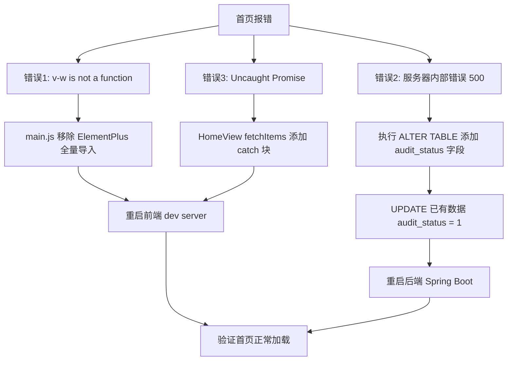

# 首页报错修复方案

## 问题分析

前端首页加载时出现 3 个错误：

### 错误 1：`v[w] is not a function`（Element Plus 冲突）

**根因**：[`main.js`](../campus_swap_front/src/main.js:3) 全量导入了 Element Plus（`import ElementPlus from 'element-plus'` + `app.use(ElementPlus)`），同时 [`vite.config.js`](../campus_swap_front/vite.config.js:13) 配置了 `AutoImport` 和 `Components` 的 `ElementPlusResolver()` 按需自动导入。两种方式同时使用会导致组件被重复注册，打包后出现运行时错误。

**修复方案**：二选一，推荐方案 A（按需导入更轻量）：

**方案 A — 保留按需导入，移除全量导入**：修改 [`main.js`](../campus_swap_front/src/main.js)：
- 删除 `import ElementPlus from 'element-plus'`
- 删除 `import 'element-plus/dist/index.css'`
- 删除 `app.use(ElementPlus)`
- 在 `vite.config.js` 中添加样式自动导入（已有 resolver，只需确认样式导入正常）

**方案 B — 保留全量导入，移除按需导入**：修改 [`vite.config.js`](../campus_swap_front/vite.config.js)：
- 移除 `AutoImport` 插件中的 `ElementPlusResolver()`
- 移除 `Components` 插件中的 `ElementPlusResolver()`

> 推荐方案 A，因为项目已经配置了按需导入的基础设施。

---

### 错误 2：`服务器内部错误`（后端 500）

**根因**：[`ItemServiceImpl.listItems()`](../src/main/java/com/itcodai/campus_swap/service/impl/ItemServiceImpl.java:35) 查询条件使用了 `.eq(Item::getAuditStatus, 1)`，对应数据库字段 `audit_status`。但 [`database.sql`](../database.sql:172) 中 `ALTER TABLE t_item ADD COLUMN audit_status` 是后追加的迁移语句，如果未执行，数据库表缺少该字段，MyBatis-Plus 生成的 SQL 会报 `Unknown column 'audit_status'` 异常，被 [`GlobalExceptionHandler`](../src/main/java/com/itcodai/campus_swap/common/exception/GlobalExceptionHandler.java:57) 捕获后返回 500。

**修复方案**：执行数据库迁移 SQL：

```sql
-- 检查并添加 audit_status 和 audit_remark 字段
ALTER TABLE t_item
  ADD COLUMN IF NOT EXISTS audit_status TINYINT NOT NULL DEFAULT 0
    COMMENT '审核状态: 0-待审核 1-已通过 2-已拒绝' AFTER status,
  ADD COLUMN IF NOT EXISTS audit_remark VARCHAR(200) DEFAULT NULL
    COMMENT '审核备注（拒绝原因）' AFTER audit_status;

-- 将已有数据标记为已通过审核（否则首页查不到任何商品）
UPDATE t_item SET audit_status = 1 WHERE audit_status = 0;
```

> 注意：如果使用的 MySQL 版本不支持 `ADD COLUMN IF NOT EXISTS`（8.0 以下），需要先手动检查字段是否存在。

---

### 错误 3：`Uncaught (in promise) Object`（Promise 未捕获）

**根因**：[`api/index.js`](../campus_swap_front/src/api/index.js:30) 响应拦截器中，当 `code !== 200` 时执行 `return Promise.reject(new Error(message))`，但 [`HomeView.vue`](../campus_swap_front/src/views/home/HomeView.vue:10) 的 `fetchItems()` 函数只有 `try/finally` 没有 `catch`，导致 rejected promise 未被捕获。

**修复方案**：在 [`HomeView.vue`](../campus_swap_front/src/views/home/HomeView.vue:10) 的 `fetchItems` 中添加 `catch` 块：

```javascript
async function fetchItems() {
  loading.value = true
  try {
    const data = await itemApi.getList({ keyword: keyword.value, page: 1, size: 20 })
    items.value = data.records || []
  } catch {
    // 错误已由响应拦截器统一提示，此处静默处理
  } finally {
    loading.value = false
  }
}
```

---

## 修复步骤总结



## 需要修改的文件

| 文件 | 修改内容 |
|------|----------|
| [`campus_swap_front/src/main.js`](../campus_swap_front/src/main.js) | 移除 Element Plus 全量导入和 `app.use(ElementPlus)` |
| [`campus_swap_front/src/views/home/HomeView.vue`](../campus_swap_front/src/views/home/HomeView.vue) | `fetchItems` 添加 `catch` 块 |
| 数据库 `campus_swap` | 执行 ALTER TABLE 添加 `audit_status` / `audit_remark` 字段 |
